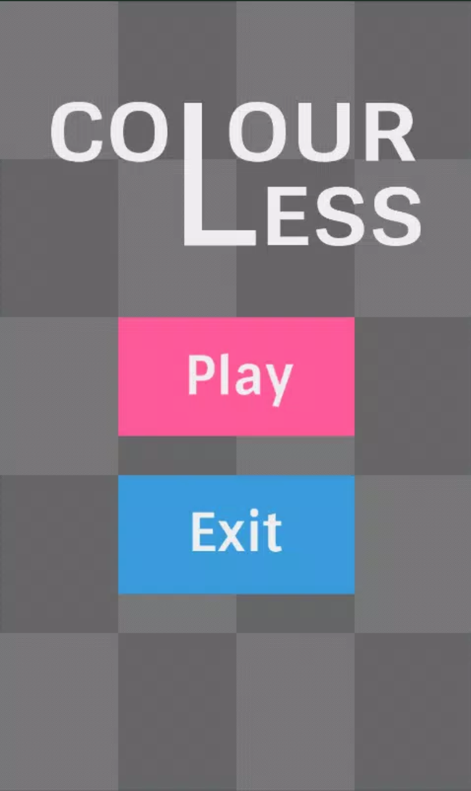
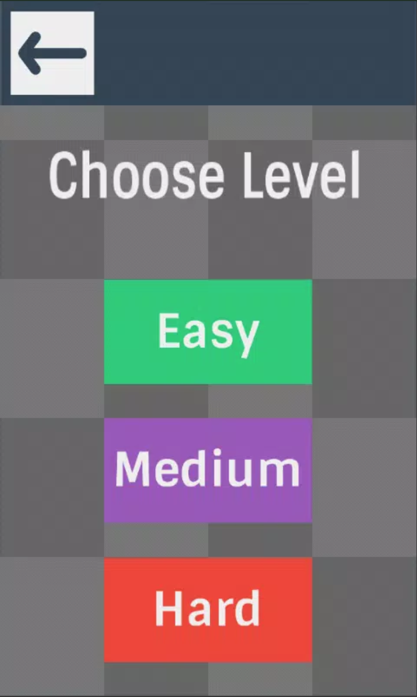
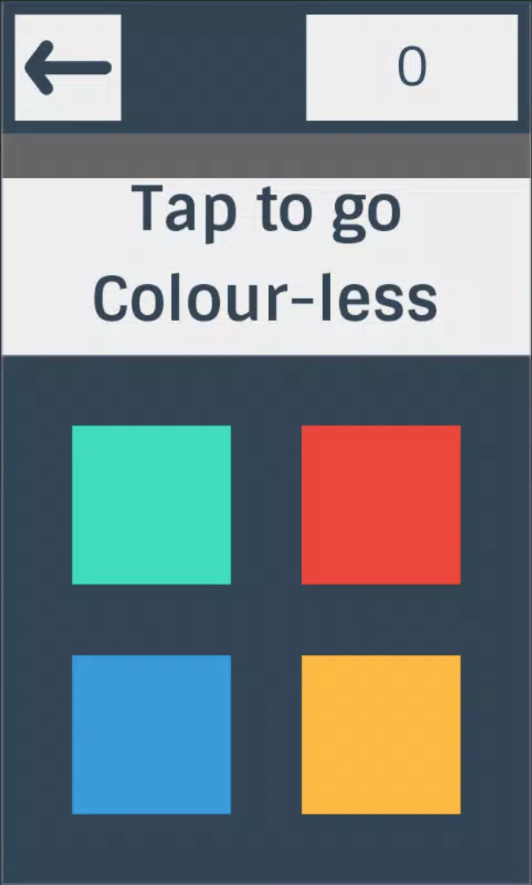
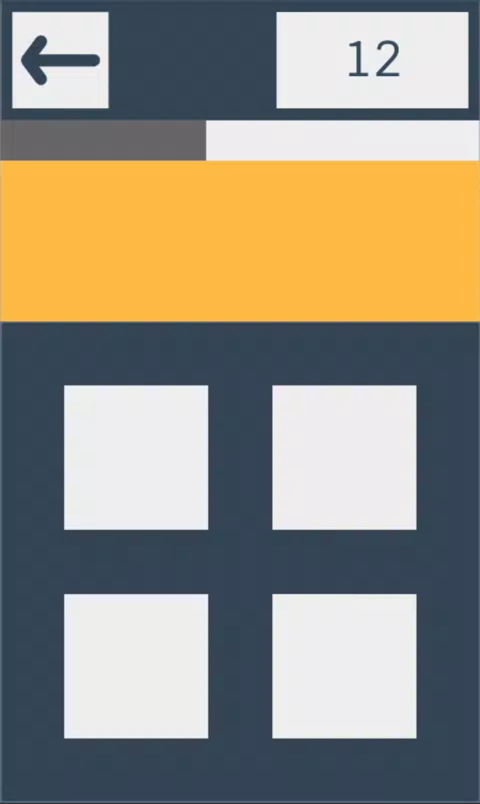
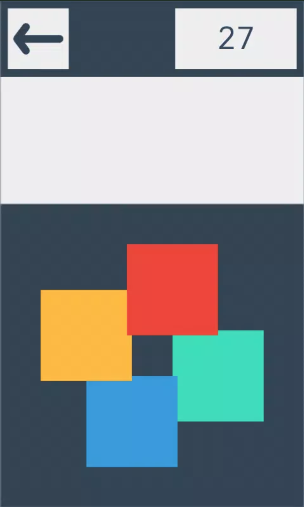
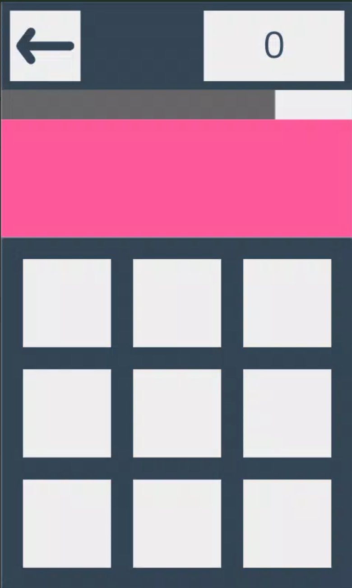
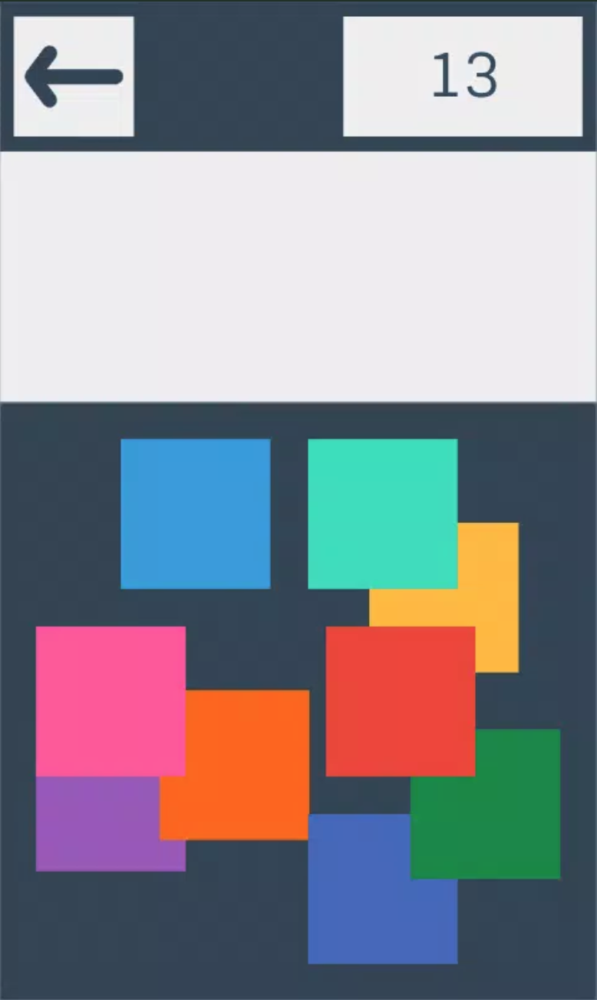
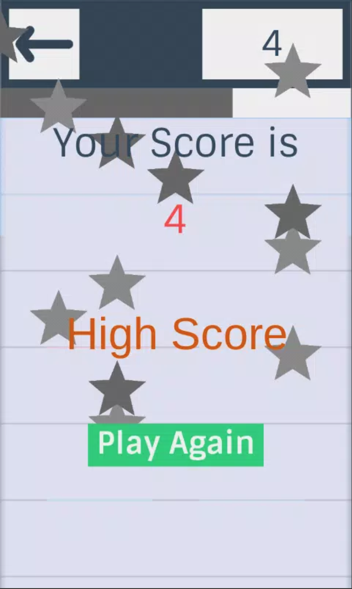

# ColourLess - A Memory Game

## Description

A Unity3D game that challenges your memory to remember colours - like a "Guess Who Card" game.

This was the first app I published on Android store Google Play back in 2015. I was interested in how games are developed and decided to design and develop a simple game using Unity3D and publish it to Google Play.

Note: The app is no longer maintained, and therefore not on Google Play anymore. But, it can still be downloaded from [here](https://m.apkpure.com/colourless-a-memory-game/com.sarahsga.Colorless)

## My Responsibilities

Full-Stack development (coding, Photoshop assets, sprites, etc) + Design

- Unity3D for game development
- C#
- Photoshop

## Screenshots

All of the below screenshots demonstrate the development / design work done by me:

