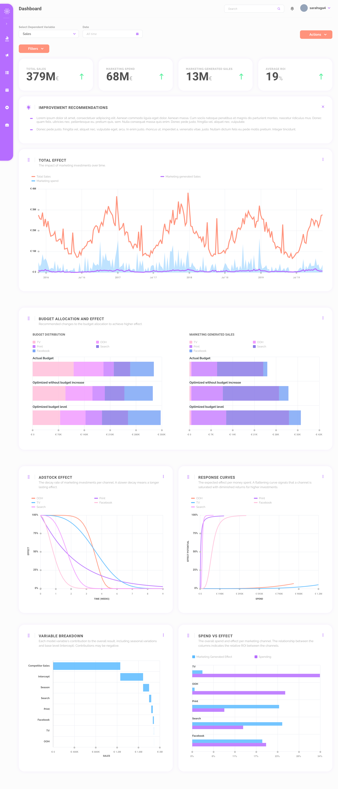
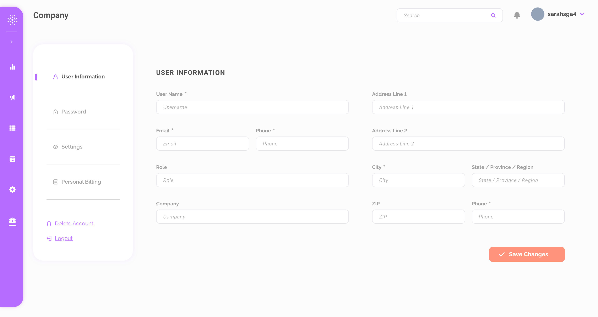
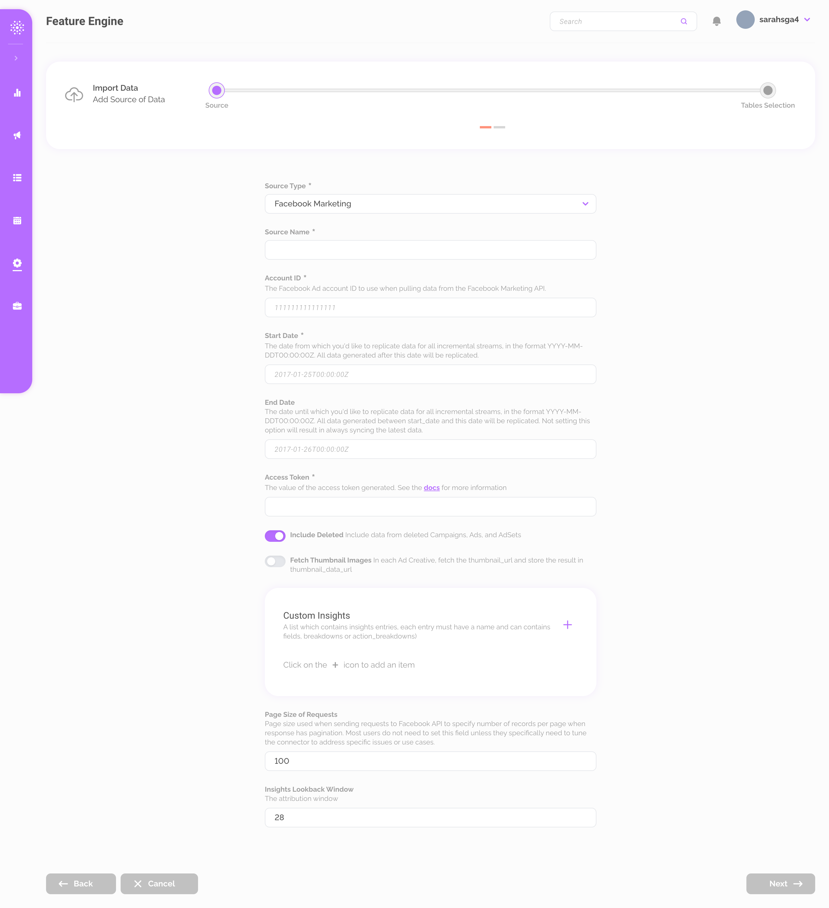
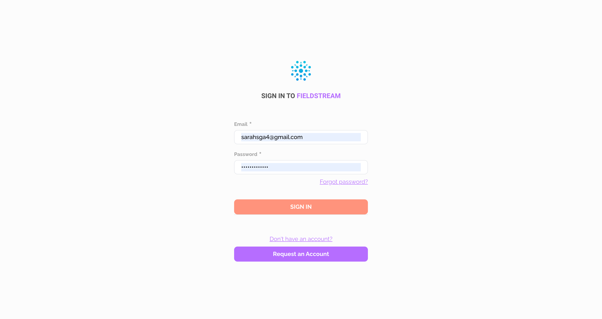

# FieldStream AB Dashboard

## Description

Dashboard for Fieldstream, a marketing analysis firm. 

## My Responsibilities

- `React (Typescript)` frontend, available [here](https://www.fieldstream.ai/our-platform)
- Pixel perfect conversion Figma designs to a web app
- `Tailwind`
- Auto generate HTML forms and validations from JSON spec
- `HTML`
- `CSS`
- `Apex Charts` for visualization

## Screenshots

All of the below screenshots demonstrate the development work done by me:

