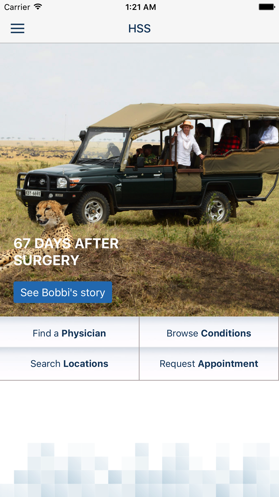
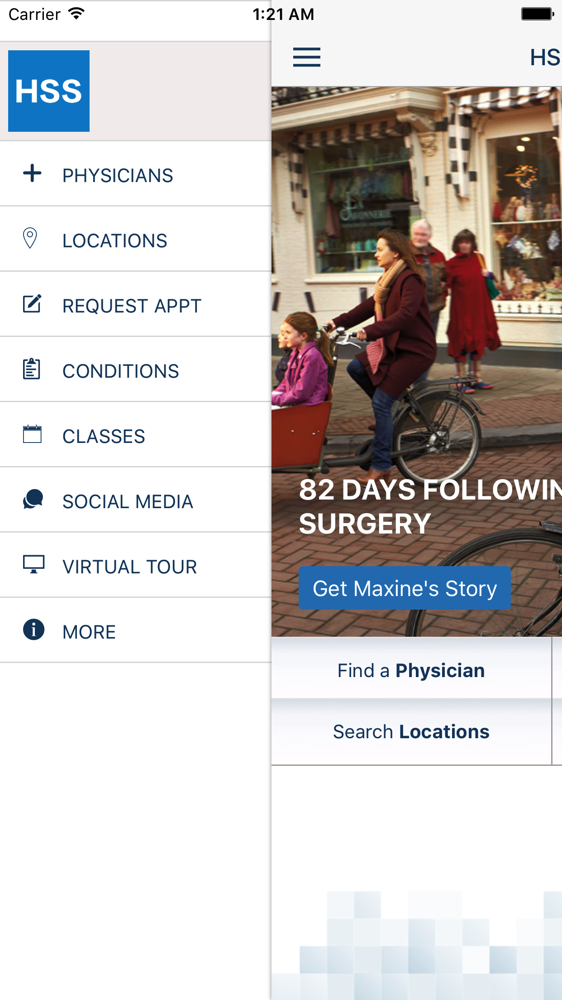
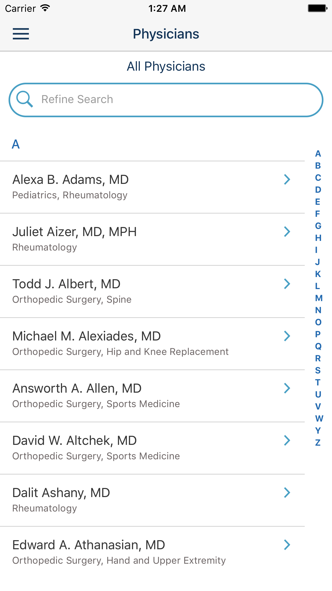
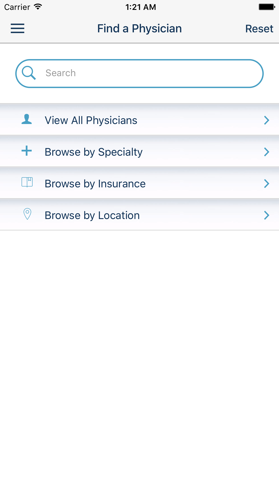
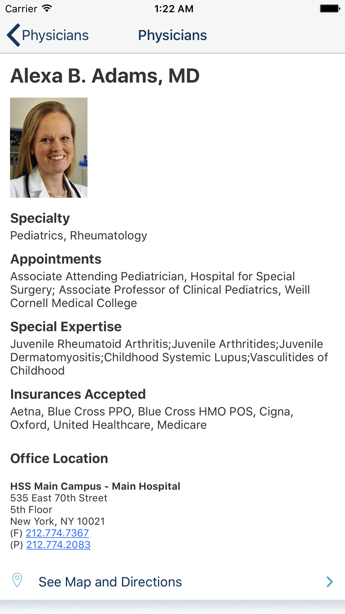

# HSS App

## Description

The official mobile app for Hospital for Special Surgery, New York, USA

- Maintain your full medical record and test results in one place
- Message doctors and manage your appointment calendar
- Get instant notifications for time-sensitive updates about your care
- Schedule in-person or virtual appointments with physicians, physical therapists, and other specialists
- Learn about care at HSS, the conditions we treat, our locations, and more
- Explore expert tips for healthy living, read patient stories, and register for online events
- Make appointments and access information even without an account

## My Responsibilities

- `Ionic (AngularJS)` frontend
- Publish to [Android PlayStore](https://play.google.com/store/apps/details?id=edu.hss.myhss&hl=en&gl=US) and [Apple AppStore](https://apps.apple.com/us/app/myhss/id1555932065)

## Screenshots

All of the below screenshots demonstrate the development / design work done by me:

