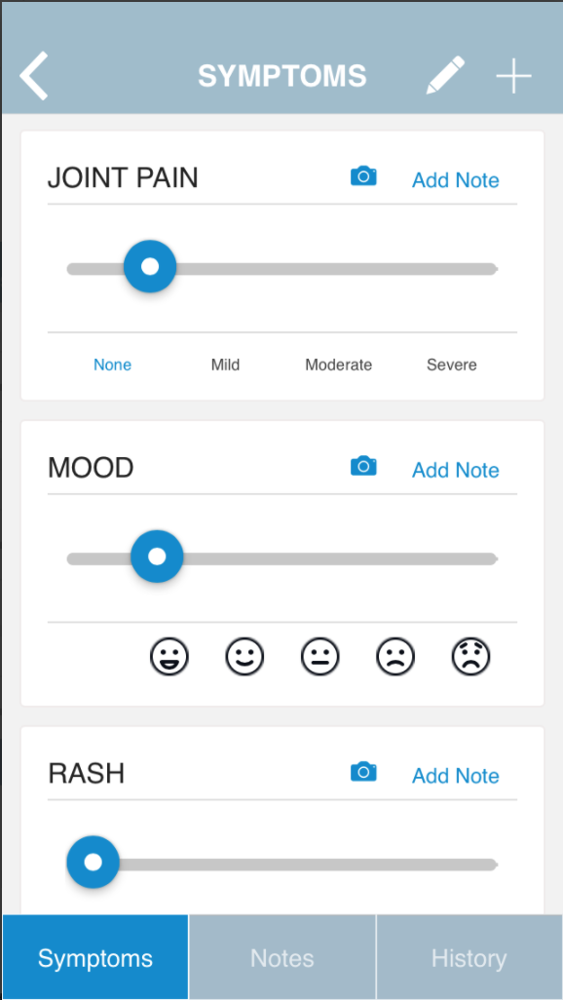

# Lupus Minder

## Description

An mobile app for Lupus Patients, developed for Hospital for Special Surgery, New York, USA.

- **Track and share your symptoms:** Record your symptoms between physician visits along with notes and photos. Share these trends with your doctor.
- **Manage your medications:** Set reminders and record side effects.
- **Be ready for your doctor visits:** Get appointment reminders. Write down questions you want to ask your doctor. Note what your doctor tells you.
- Be informed about lupus research, initiatives and support programs.

## My Responsibilities

- `Ionic (AngularJS)` frontend
- Publish to [Android PlayStore](https://play.google.com/store/apps/details?id=com.hss.lupusminder&hl=en&gl=US) and **Apple Appstore**

## Screenshots

All of the below screenshots demonstrate the development / design work done by me:

