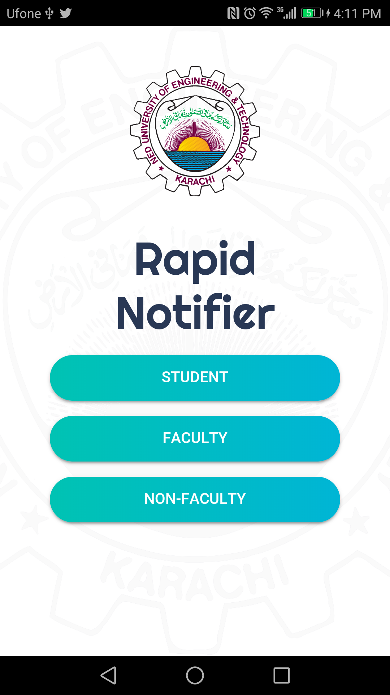
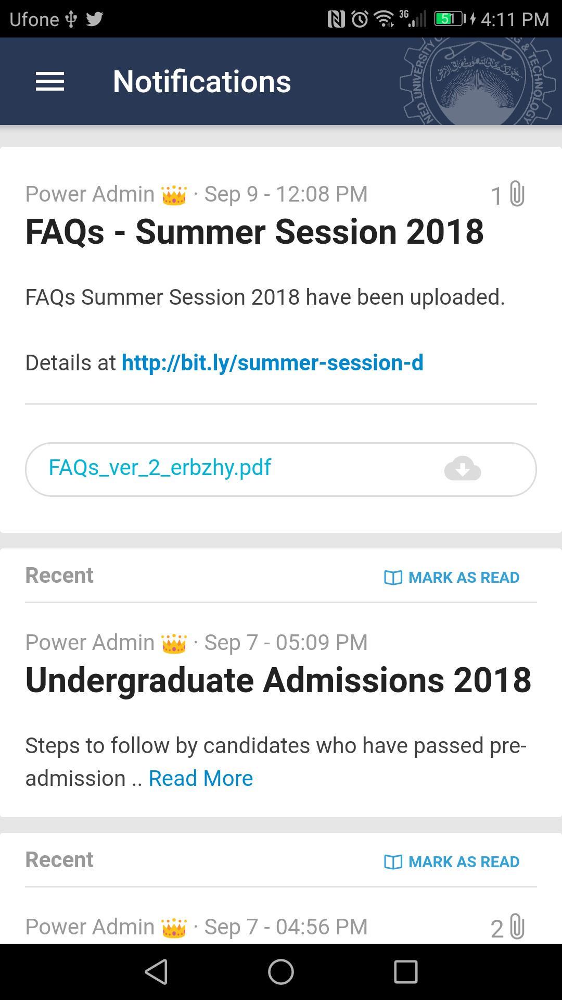
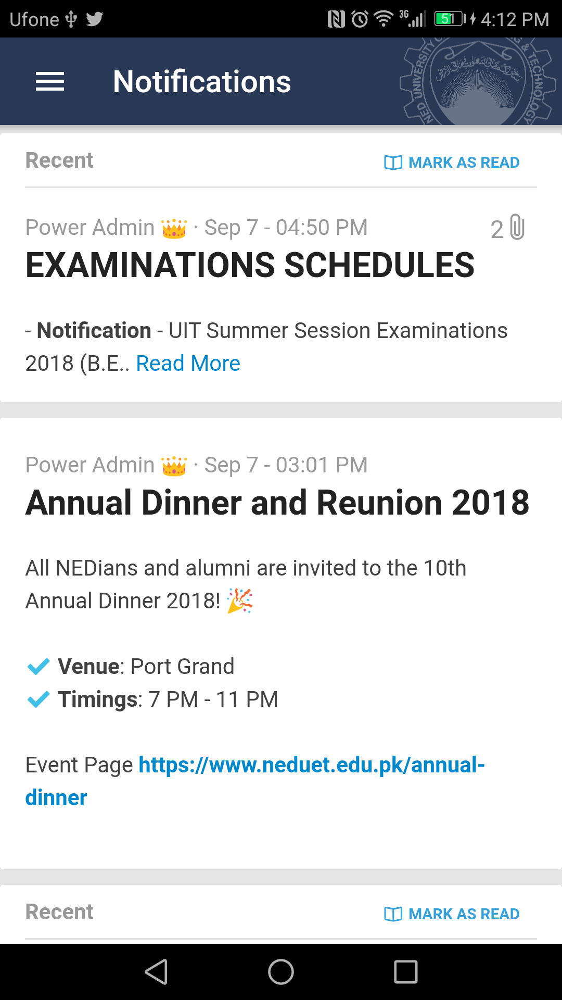
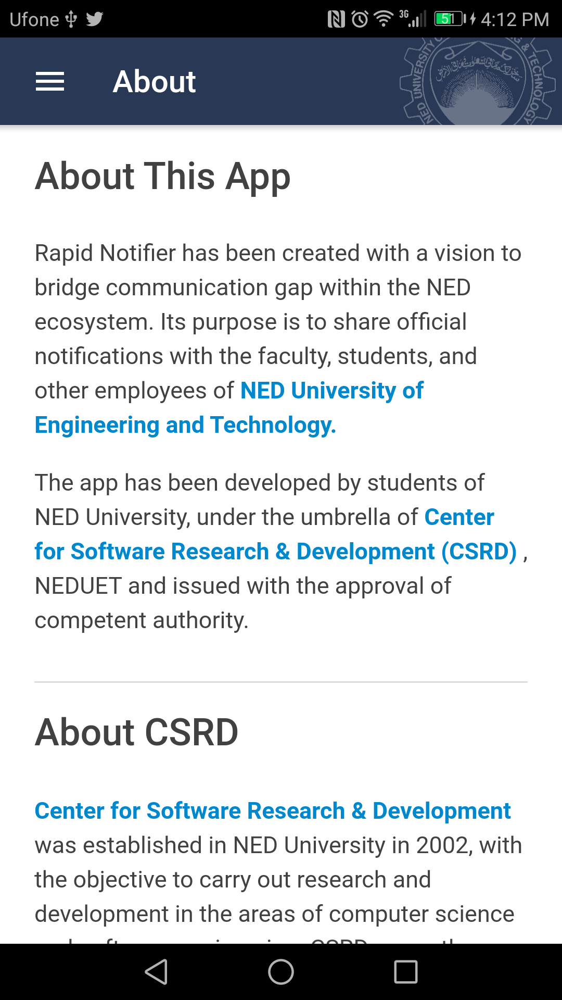
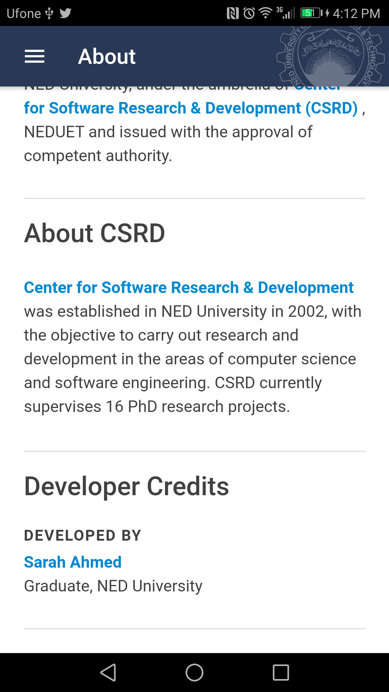
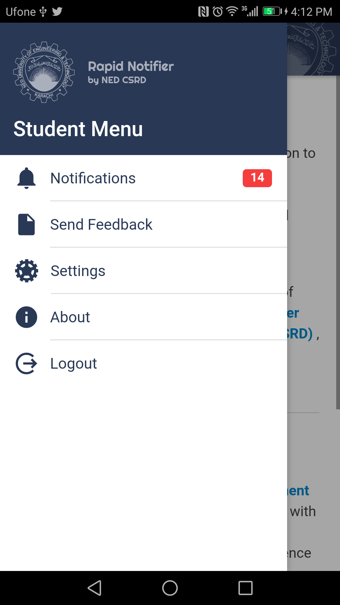

# Rapid Notifier

## Description

A Notifier mobile app for NED University of Engineering and Technology

It allows the university administrators to broadcast notifications to teachers and students. These notifications may include text, images, files, lists, or links etc.

## My Responsibilities

Full-Stack (Frontend, REST API, unit testing) + UI Design

- `Ionic (AngularJS)` frontend
- Push Notifications
- `NodeJS` REST API
- `MongoDB` database
- **Publish** to [Android PlayStore](https://play.google.com/store/apps/details?id=ned.rapid.notifier&hl=en&gl=US) and `Apple AppStore`
- `InVision App` for UI Design

## Screenshots

All of the below screenshots demonstrate the development / design work done by me:

