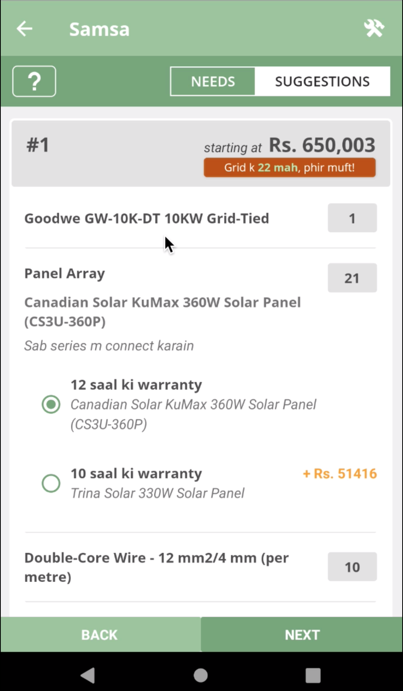
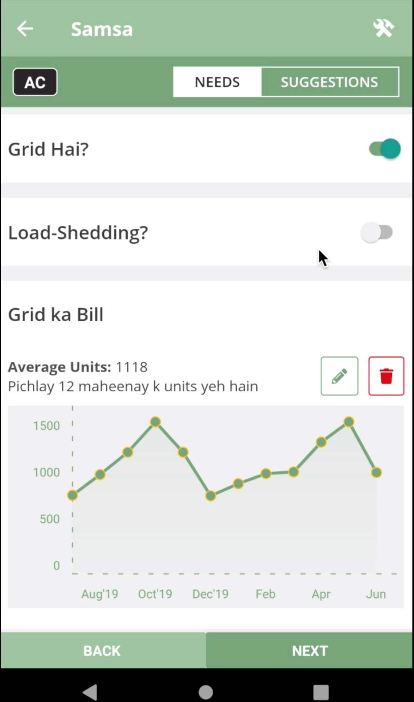
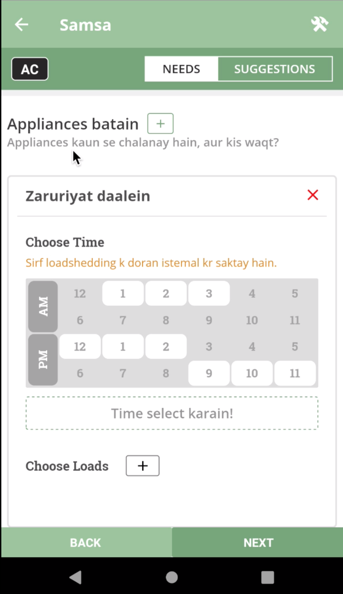
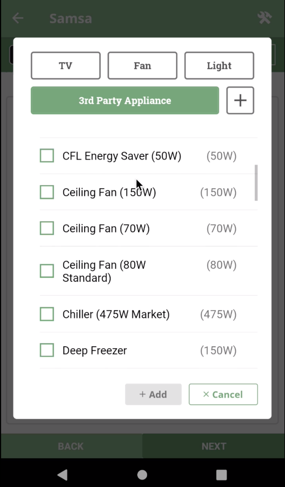
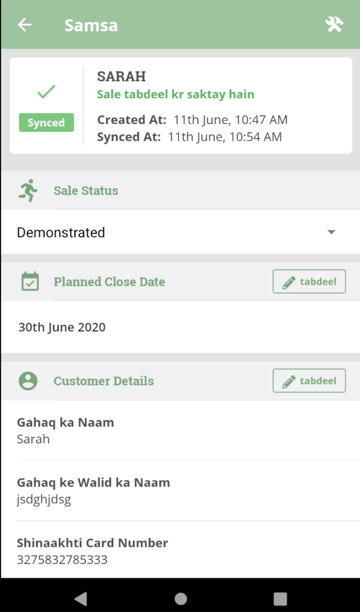
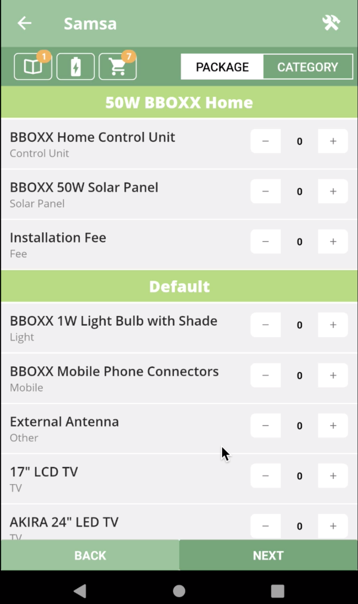
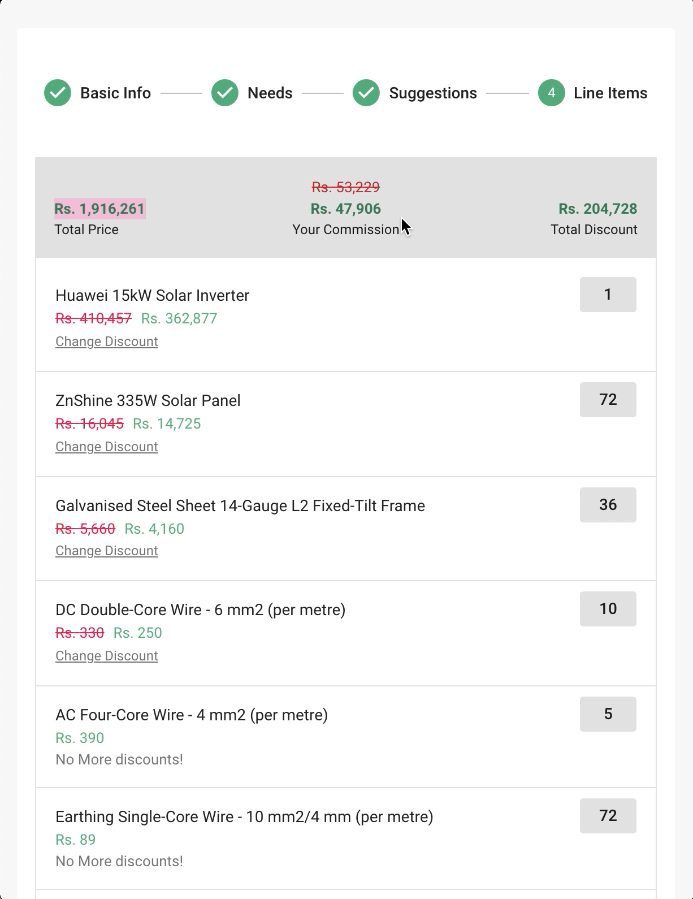
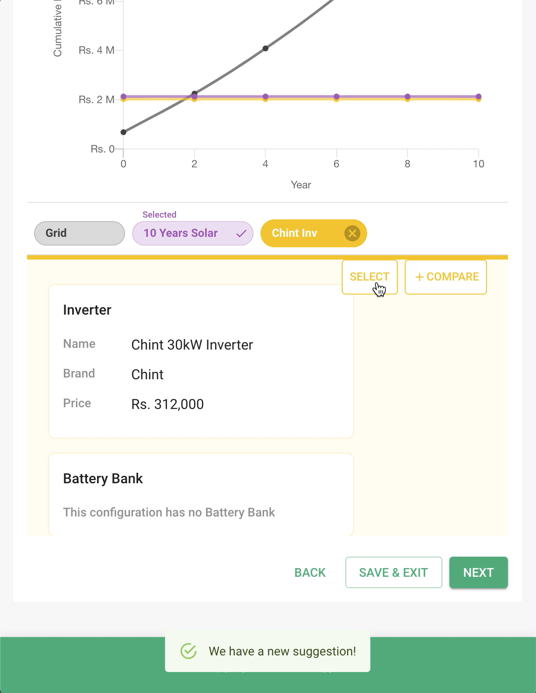
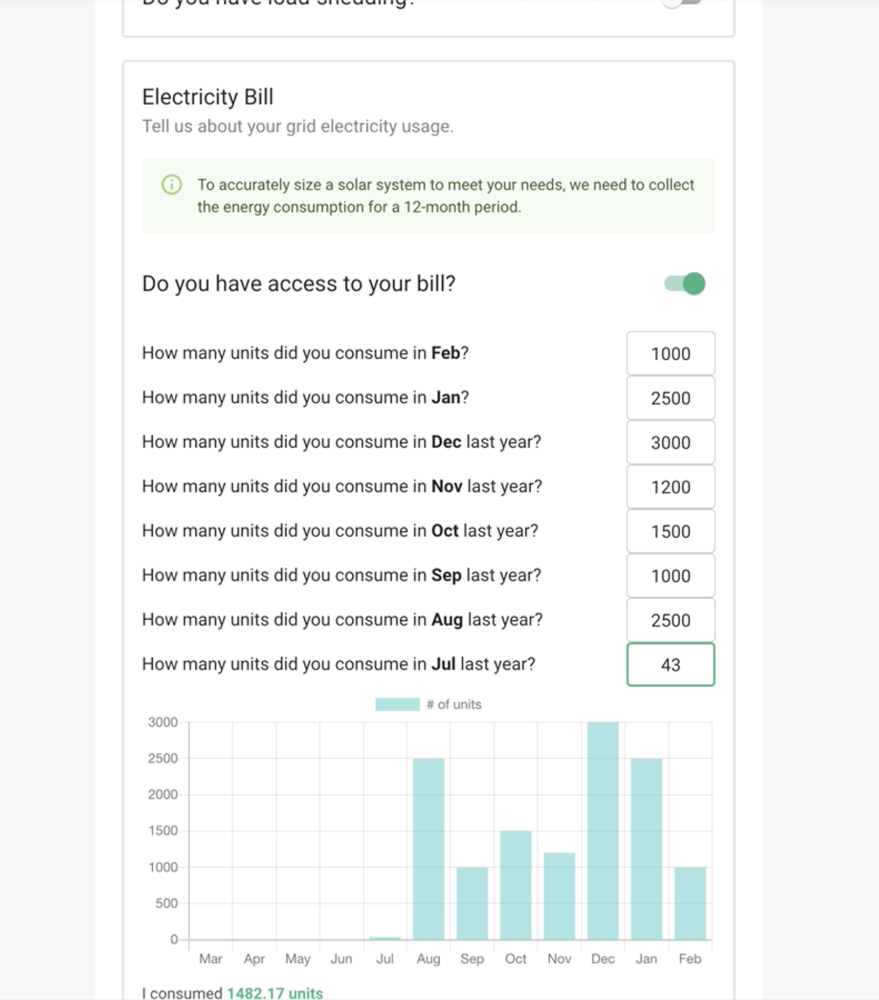
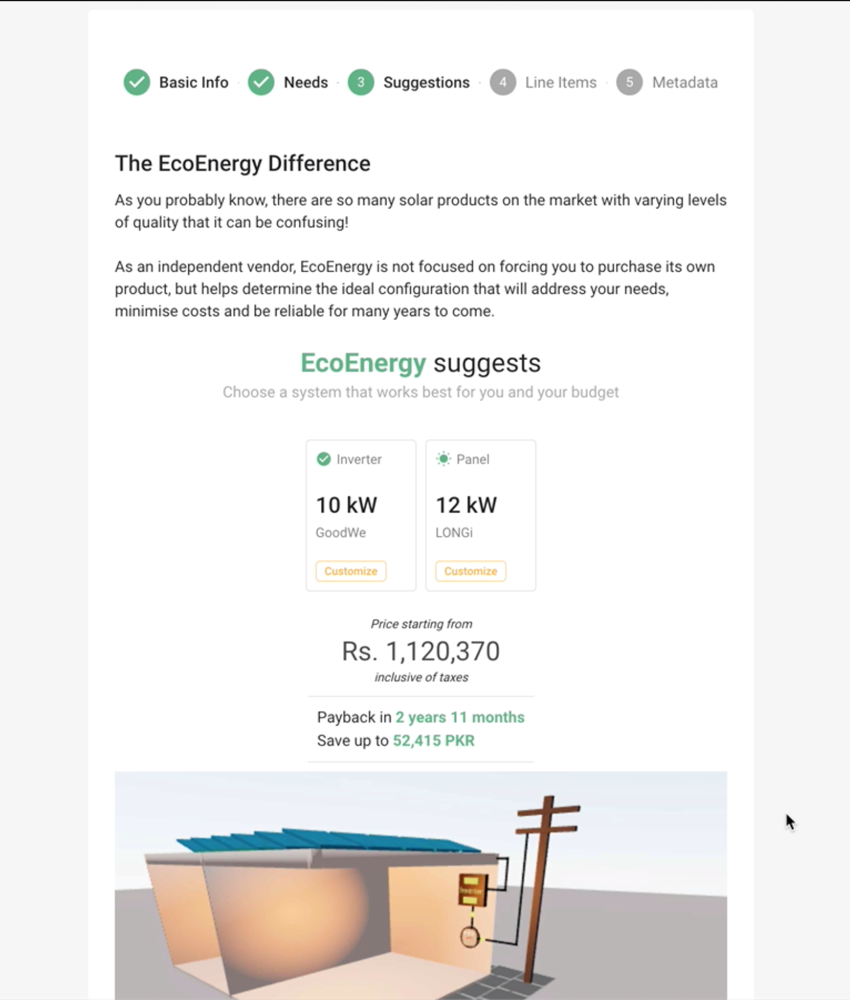

# Samsa

## Description

Deployed [here](https://ecoenergy.pk/) and [here](https://quote.ecoenergy.pk/)

A web application for sizing a solar PV solution based on the customer’s energy requirements.

The customer inputs their daily electricity needs (e.g. fans, bulbs, ACs, fridge, etc) and duration of use, and the app suggests a solar PV solution - the battery bank, panel array, and inverter size, as well as the wiring and other electrical components required for installation.

## My Responsibilities

Full-Stack (Frontend, Serverless backend, unit testing) + UI Design

- `React Native` for [Mobile frontend](https://apkcombo.com/samsa/com.ecoenergy.samsa/)
- `ReactJS` for [Web frontend](https://ecoenergy.pk/)
- `Jest` for **Test-driven development** of sizing algorithm using `Javascript`
- `Amazon Web Services` for Serverless backend
  - AWS Cognito
  - AWS AppSync API
  - AWS Lambda
  - AWS DynamoDB
  - AWS SES
  - AWS S3
  - AWS CloudFormation
  - AWS CloudWatch
  - and more...
- `InVision App` for UI Design

## Screenshots

All of the below screenshots demonstrate the development / design work done by me:

### Mobile

### Web

