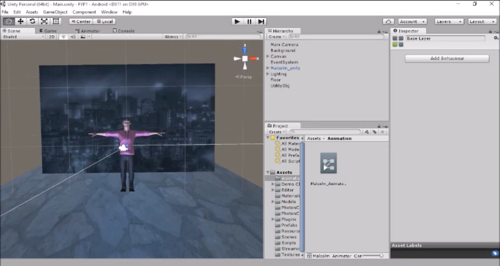
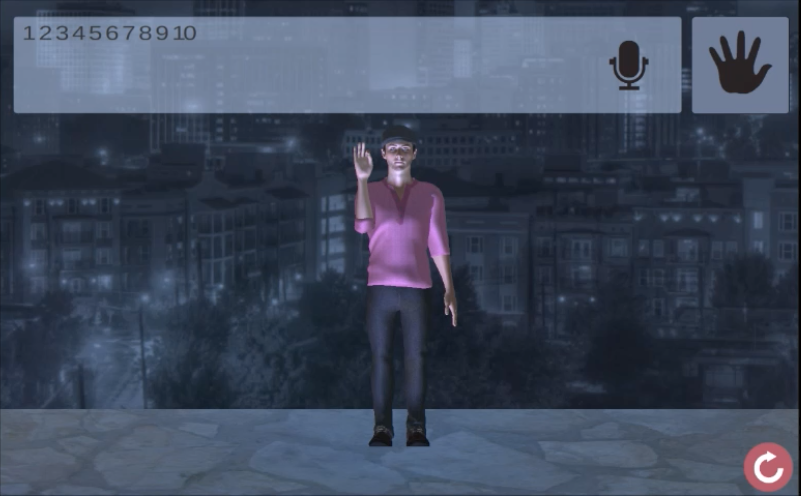
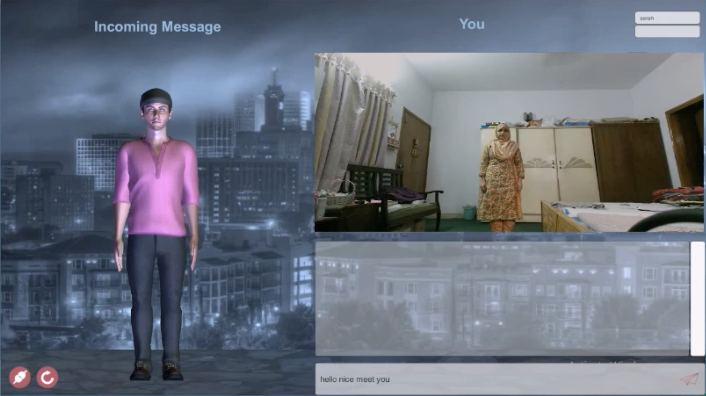

# Seamless Communication for Hearing Impaired

## Description

This is a sign-language-to-voice (and vice-versa) translator, developed in Unity3D using Kinect. You can find a demo of it [here](https://bit.ly/seamless-communication-for-hearing-impaired-demo)

It consists of 2 modules.

1. **Dictionary Module:**
A mobile application, which converts text/voice into sign-language (text-to-sign dictionary). The conversion is performed by a rigged 3D model. We have created a database of 30 3D-rigged gestures including 78 word variations. The application is capable of taking a sentence as an input and understands synonyms, then 3D model performs the corresponding gestures flawlessly. The sole purpose behind developing this app is to replace a human translator with an automated one. 

2. **Distant Communication Module:**
This module attempts to replicate the existing phone call system, for hearing impaired people who use sign language instead of voice as their mode of communication. This module takes gesture input using Kinect device, sends the gesture to a gesture recognizer, which translates it into text. This text is then sent over a Wi-Fi connection to a recipient device. If the recipient is also hearing impaired, the received text is sent to a gesture synthesizer that outputs a series of gestures played back by a 3D rigged model.

## My Responsibilities

All stages of the software lifecycle - Planning, Design, Development, Testing, etc

- Unity3D for game development
- C#
- Photoshop
- Blender for 3D modelling
- Microsoft Kinect
- Java (for Android App developed for receiving sign-language-to-text messages on your phone)

## Screenshots

All of the below screenshots demonstrate the development / design work done by me:

